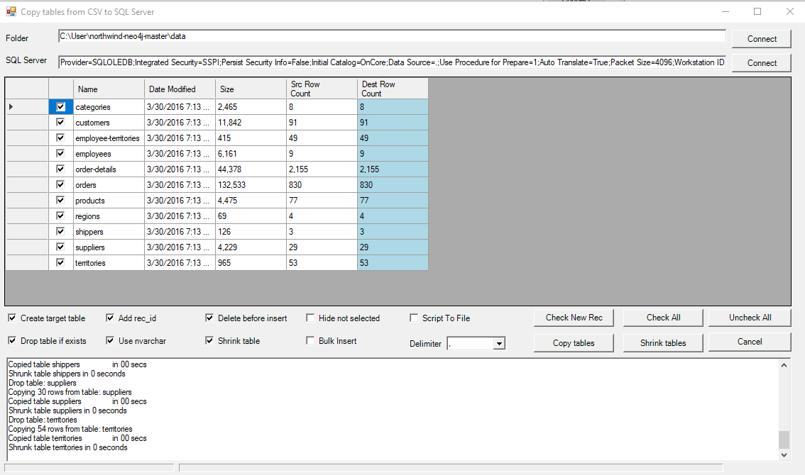

Originally posted here:
<https://www.codeproject.com/Articles/5364500/CSV-to-SQL-Server/>

This application lets you copy tables from folder with CSV files to SQL Server

## Introduction
I developed this application to help me migrate CSV files to SQL Server. It was too much trouble importing the files using SSIS and SSMS import flat file feature.

The application assumes that the first row contains column names. I hope someone else will also find this code useful.

## Background
This application is fairly simple: you select the folder where CSV files reside, select the SQL Server database you want to copy the tables, select the tables you want to copy and click Copy tables. The application will create tables in the SQL server database and copy the data.

The imported files will be of varchar(max) / varchar(max) type (depending on Use nvarchar setting). But if Shrink table is checked, the application will attempt to detect and change data types based on the data.

## Other features:

- Create target table - will create table if it does not exist
- Add rec_id - will add primary key called rec_id identity(1,1)
- Delete before insert - will delete all records before coping data
- Drop table if exists
- Delimiter - column data delimiter. Comma (,) is default.
- Check New Rec - check tables that different source and destination count
- Check All - check all tables
- Uncheck All - uncheck all tables
- Script to File - will log to file instead of executing the SQL

The application uses TextFieldParser to read CSV files.
